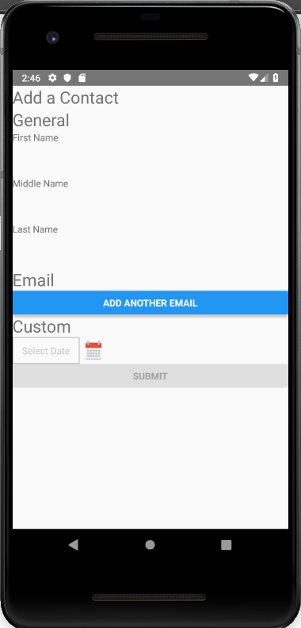

# Contact Form

## Goal

Explore using Formik and Yup for creating an add contact form in React Native.

## Progress

- [x] Require a first name or last name for a contact
- [x] Support adding multiple emails with required validation
- [x] Support the react-native-datepicker library for picking a birthday

## Tools

- React Native
- Formik
- Yup

## License

[MIT](./LICENSE)

## Contributing

See [Contributing](./CONTRIBUTING)
